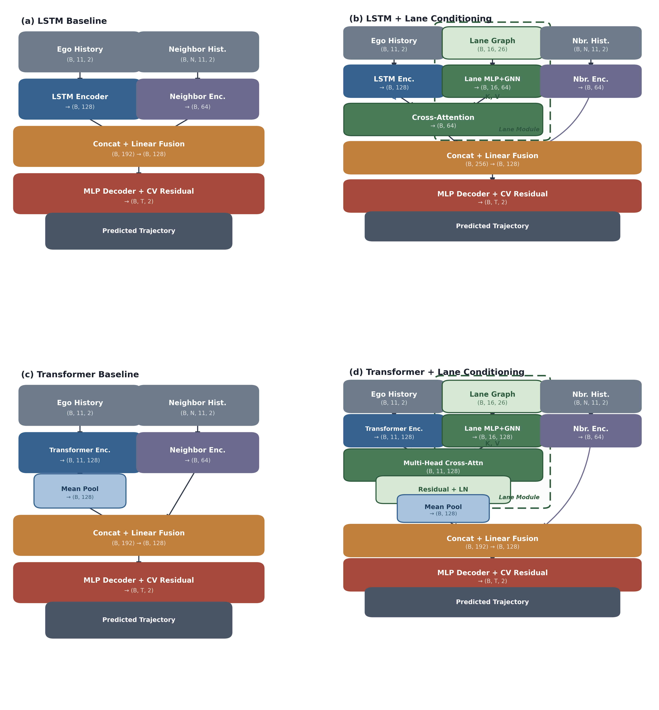
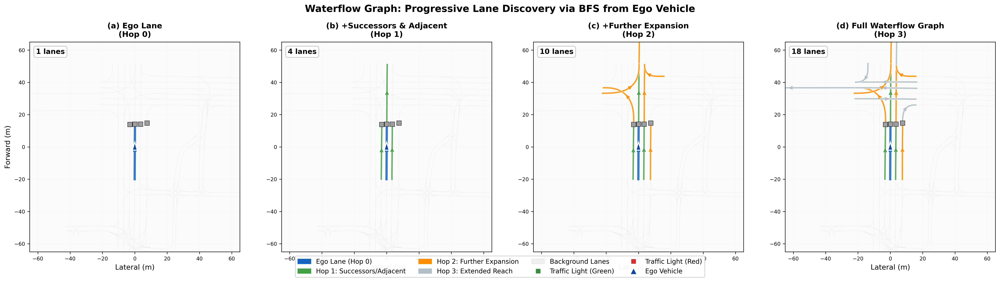

# Lane Graph Conditioning for Trajectory Prediction

[](https://www.python.org/downloads/)
[](https://pytorch.org/)
[](LICENSE)

**Local Lane Graph Conditioning as a General Inductive Bias for Trajectory Prediction**

[[Paper]](https://obsicat.com/lane-conditioning.html)

<p align="center">
  
</p>

## Abstract

We propose **lane graph conditioning**, a lightweight module that injects local lane topology into trajectory prediction models. Using a waterflow-inspired BFS algorithm, we extract lane features along each agent's heading direction and fuse them via a learned gate. The approach is architecture-agnostic and adds only +7.5% parameters while delivering up to **27% lower minADE** and **43% lower miss rate** on 8-second prediction horizons.

## Key Results

All experiments are conducted on the **Waymo Open Motion Dataset (WOMD) v1.1** with 89K signalized intersection scenes.

| Setting | Metric | Baseline | Lane-Cond | Improvement |
|---------|--------|----------|-----------|-------------|
| 3s LSTM (3 seeds) | ADE | 0.559 +/- 0.007 | **0.507 +/- 0.011** | **+9.3%** (p=0.007) |
| 8s LSTM K=6 (3 seeds) | minADE | 1.868 +/- 0.042 | **1.371 +/- 0.081** | **+26.7%** (p=0.003) |
| 8s LSTM K=6 (3 seeds) | minFDE | 5.047 +/- 0.106 | **3.403 +/- 0.242** | **+32.6%** (p=0.004) |
| 8s LSTM K=6 (seed 42) | MR@5m | 33.9% | **19.4%** | **+42.7%** |
| 8s TF single (seed 42) | ADE | 4.859 | **3.303** | **+32.0%** |

### Error Decomposition (8s, K=6)

| Component | Baseline | Lane-Cond | Improvement |
|-----------|----------|-----------|-------------|
| Avg Longitudinal | 1.238 | 0.924 | +25.4% |
| Avg Lateral | 0.919 | 0.675 | +26.5% |
| Endpoint Longitudinal | 3.561 | 2.577 | +27.6% |
| Endpoint Lateral | 2.687 | 1.867 | **+30.5%** |

<p align="center">
  
</p>

## Installation

```bash
git clone https://github.com/Jynxzzz/scenario-dreamer-jynxzzz.git
cd scenario-dreamer-jynxzzz
pip install -r requirements.txt
```

## Data Preparation

This project uses the [Waymo Open Motion Dataset (WOMD) v1.1](https://waymo.com/open/download/).

1. Download the WOMD v1.1 dataset from the official Waymo website.
2. Extract trajectory data using the preprocessing scripts:
   ```bash
   # Preprocess raw Waymo data into trajectory format
   python datasets/traj_dataset.py --data_dir /path/to/waymo_data --output_dir /path/to/processed
   ```
3. Update the `data_dir` field in the config files under `configs/` to point to your processed data directory.

## Training

### LSTM Baseline (3-second prediction)
```bash
python training/train.py --config configs/lstm_baseline.yaml
```

### LSTM + Lane Conditioning (3-second prediction)
```bash
python training/train.py --config configs/lstm_lane_cond.yaml
```

### Multi-modal LSTM K=6 (8-second prediction)
```bash
python training/train.py --config configs/lstm_multimodal.yaml
```

### Multi-modal LSTM + Lane Conditioning K=6 (8-second prediction)
```bash
python training/train.py --config configs/lstm_multimodal_lane.yaml
```

### Transformer Baseline (8-second prediction)
```bash
python training/train.py --config configs/tf_baseline.yaml
```

### Transformer + Lane Conditioning (8-second prediction)
```bash
python training/train.py --config configs/tf_lane_cond.yaml
```

## Evaluation

Evaluation metrics (ADE, FDE, minADE, minFDE, MR@5m) are computed automatically at the end of each training run. To run evaluation separately:

```bash
python training/train.py --config configs/lstm_multimodal_lane.yaml --test_only --ckpt_path /path/to/checkpoint.ckpt
```

### Error Decomposition Analysis
```bash
python scripts/error_decomposition.py --baseline_dir /path/to/baseline/outputs --lane_cond_dir /path/to/lane_cond/outputs
```

### Generate Paper Figures
```bash
python scripts/generate_paper_figures.py --results_dir /path/to/results --output_dir figures/
```

## Project Structure

```
scenario-dreamer-jynxzzz/
├── models/                      # Model architectures
│   ├── lstm_baseline.py         # LSTM baseline encoder-decoder
│   ├── lane_conditioned_lstm.py # LSTM + lane graph conditioning
│   ├── multimodal_lstm.py       # Multi-modal LSTM (K=6, WTA loss)
│   ├── multimodal_lane_cond.py  # Multi-modal LSTM + lane conditioning
│   ├── transformer_baseline.py  # Transformer baseline
│   └── transformer_lane_cond.py # Transformer + lane conditioning
├── training/                    # Training infrastructure
│   ├── train.py                 # Main training entry point
│   ├── lightning_module.py      # PyTorch Lightning module (single-modal)
│   ├── multimodal_lightning_module.py  # Multi-modal Lightning module
│   └── metrics.py               # ADE, FDE, minADE, minFDE, MR computation
├── datasets/                    # Data loading
│   ├── traj_dataset.py          # Waymo trajectory dataset
│   └── lane_feature_utils.py    # Lane feature extraction utilities
├── tools/lane_graph/            # Lane graph extraction
│   ├── lane_explorer.py         # Waterflow BFS lane graph algorithm
│   └── lane_graph_builder.py    # Lane graph construction
├── configs/                     # Training configurations
├── scripts/                     # Analysis and visualization
└── figures/                     # Paper figures
```

## Citation

If you find this work useful, please cite:

```bibtex
@article{zhou2026lane,
  title={Local Lane Graph Conditioning as a General Inductive Bias for Trajectory Prediction},
  author={Zhou, Xingnan and Alecsandru, Ciprian},
  journal={Sustainability},
  year={2026},
  publisher={MDPI}
}
```

## Acknowledgments

Built upon the [Scenario Dreamer](https://github.com/ss-zheng/Scenario-Dreamer) framework.
