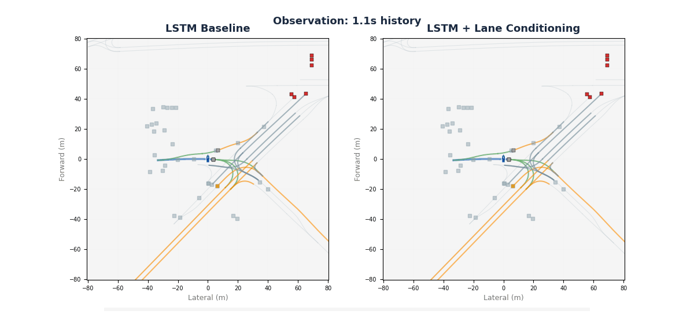
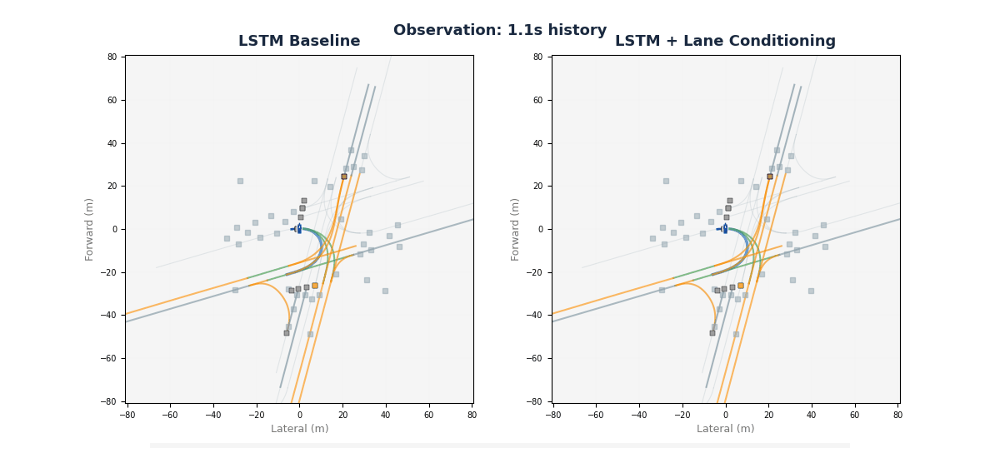
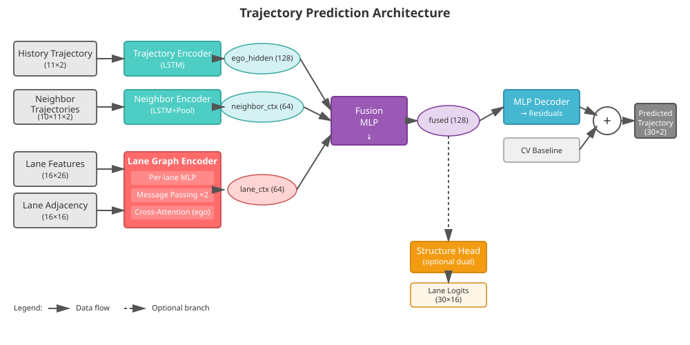

# Local Lane Graph Conditioning for Trajectory Prediction

<p align="left">
<a href="https://obsicat.com/lane-conditioning.html">
    </a>
<a href="https://obsicat.com/assets/lane-conditioning-paper.pdf">
    </a>
</p>

> **Local Lane Graph Conditioning as a General Inductive Bias for Trajectory Prediction: A Multi-Architecture Study on the Waymo Open Motion Dataset**
> [Xingnan Zhou](https://obsicat.com), Ciprian Alecsandru
> Department of Building, Civil and Environmental Engineering, Concordia University, Montreal
> Submitted to MDPI Sustainability, 2026

<p align="center">
  
  
</p>
<p align="center"><em>Left turn (minADE: 8.95m → 3.09m) and straight-through (4.35m → 1.19m) — Baseline (left) vs Lane-Conditioned (right)</em></p>

## Overview

We propose a **waterflow lane graph extraction** method that constructs a local, ego-centric lane topology through breadth-first traversal of the HD map, and a lightweight lane encoder with **graph message passing** and **cross-attention fusion**. The module is architecture-agnostic and improves both LSTM and Transformer backbones.

**Key results on 89,258 signal-controlled Waymo intersection scenarios** (3 seeds for multi-seed rows; statistical significance via paired *t*-test):

| Setting | Model | minADE (m) | minFDE (m) | vs Baseline |
|---------|-------|------------|------------|-------------|
| 3 s, single-modal (3 seeds) | LSTM + Lane Cond. | **0.507 ± 0.011** | — | **+9.3%** ADE (*p* = 0.007) |
| 8 s, single-modal (seed 42) | LSTM + Lane Cond. | **3.075** | **8.688** | **+18.7%** ADE |
| 8 s, single-modal (3 seeds) | Transformer + Lane Cond. | **3.175 ± 0.140** | **8.744 ± 0.286** | **+26.8%** ADE (*p* = 0.030) |
| 8 s, *K* = 6 multi-modal (3 seeds) | LSTM + Lane Cond. | **1.371 ± 0.081** | **3.403 ± 0.242** | **+26.6%** / **+32.6%** / **+42.7%** (minADE / minFDE / MR@5m, *p* < 0.005) |

Our lane-conditioned multi-modal LSTM reaches **minADE = 1.37 ± 0.08 m** using only 2D positions plus local lane features — errors of the same order of magnitude as [published LSTM baselines](https://arxiv.org/abs/2104.10133) that consume substantially richer inputs. **This is not a fair comparison and no equivalence is claimed**: our task is ego-vehicle self-prediction at signal-controlled intersections on a custom split, not the official multi-agent benchmark.

## Method

<p align="center">
  
</p>

1. **Waterflow Lane Graph Extraction** — 3-hop BFS from the ego lane, reducing graph size by ~80%
2. **Graph Message Passing** — 2 rounds of lane feature propagation along connectivity edges
3. **Cross-Attention Fusion** — Lane embeddings attend to trajectory features
4. **CV-Residual Decoder** — Predicts residuals relative to constant-velocity baseline; K=6 heads for multi-modal

The lane module adds **fewer than 50K parameters (~8% overhead)** for LSTM, achieving a 26.6% minADE improvement at 8 s (3-seed mean, *p* = 0.003). A controlled full-graph ablation (nearest 64 lanes) shows a consistent trend favouring topologically guided local selection over brute-force spatial proximity (**+11.4%** minADE, *p* = 0.063, not statistically significant); a 2×2 decoupling ablation attributes ~70% of this gap to lane selection and ~30% to adjacency density.

## Repository Structure

```
├── models/                  # Model definitions
│   ├── lstm_baseline.py     # LSTM encoder-decoder baseline
│   ├── lane_conditioned_lstm.py  # LSTM + lane conditioning
│   ├── transformer_baseline.py   # Transformer baseline
│   ├── transformer_lane_cond.py  # Transformer + lane conditioning
│   ├── multimodal_lstm.py        # Multi-modal K=6 baseline
│   ├── multimodal_lane_cond.py   # Multi-modal + lane conditioning
│   └── flow_matching.py          # Flow matching (experimental)
├── training/                # Training infrastructure
│   ├── train.py             # Hydra-based entry point
│   ├── lightning_module.py  # PyTorch Lightning module
│   ├── multimodal_lightning_module.py
│   └── metrics.py           # ADE, FDE, MR evaluation
├── datasets/trajectory/     # Data loading
│   ├── traj_dataset.py      # Dataset with lane graph loading
│   └── lane_feature_utils.py
├── tools/                   # Core utilities
│   ├── lane_graph/          # Waterflow extraction & graph building
│   ├── scene_loader.py      # Unified scene loading
│   └── encoder/             # Trajectory & lane tokenization
├── configs/                 # Hydra configs
│   └── config.yaml          # Base configuration
├── docs/project-page/       # Project page (obsicat.com)
└── environment.yml          # Conda environment
```

## Setup

```bash
git clone https://github.com/Jynxzzz/lane-graph-conditioning.git
cd lane-graph-conditioning

conda env create -f environment.yml
conda activate scenario-dreamer
```

### Data

This project uses the [Waymo Open Motion Dataset v1.1.0](https://waymo.com/open/). We preprocess scenes into per-scenario pickle files containing trajectory data, lane graphs, and traffic light states.

```bash
# Preprocess Waymo TFRecords (requires waymo-open-dataset-tf)
bash data_processing/prepare_waymo_data_with_traffic_light.sh
```

## Training

```bash
# LSTM Baseline (8s, single-modal)
python training/train.py model.name=lstm_baseline data.future_len=80

# LSTM + Lane Conditioning (8s, single-modal)
python training/train.py model.name=lane_conditioned data.future_len=80

# Multi-Modal K=6 Baseline (8s)
python training/train.py model.name=multimodal_lstm_baseline data.future_len=80

# Multi-Modal K=6 + Lane Conditioning (8s)
python training/train.py model.name=multimodal_lane_cond data.future_len=80

# Transformer + Lane Conditioning (8s)
python training/train.py model.name=tf_lane_cond data.future_len=80
```

All training uses PyTorch Lightning with cosine annealing LR. We recommend **100 epochs** — the lane-conditioned model converges slower but reaches a lower asymptote.

## Error Decomposition

| Component | Baseline (m) | Lane-Cond (m) | Improvement |
|-----------|-------------|----------------|-------------|
| Avg Longitudinal | 1.238 | 0.924 | +25.4% |
| Avg Lateral | 0.919 | 0.675 | +26.5% |
| Endpoint Longitudinal | 3.561 | 2.577 | +27.6% |
| **Endpoint Lateral** | **2.687** | **1.867** | **+30.5%** |

Lane conditioning provides balanced improvements across both error axes, with endpoint lateral error (+30.5%) showing the strongest gain.

## Acknowledgements

This project builds on the [Scenario Dreamer](https://github.com/RLuke22/scenario-dreamer-waymo) framework (CVPR 2025) for Waymo data processing.

## Citation

```bibtex
@article{zhou2026lanegraph,
  title={Local Lane Graph Conditioning as a General Inductive Bias for Trajectory Prediction: A Multi-Architecture Study on the Waymo Open Motion Dataset},
  author={Zhou, Xingnan and Alecsandru, Ciprian},
  journal={Sustainability},
  year={2026},
  publisher={MDPI}
}
```
